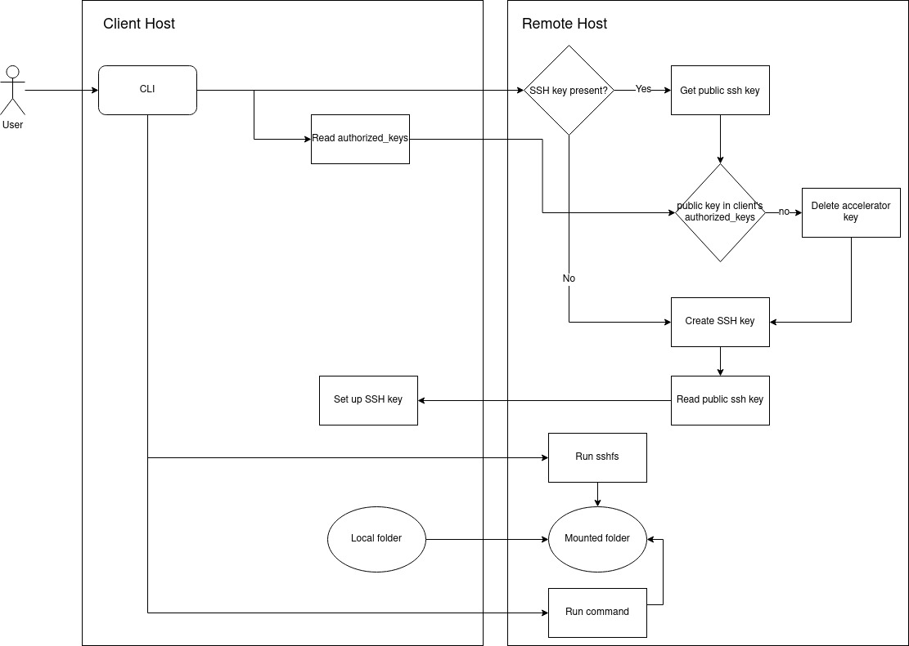

Accelerator
===========

The accelerator script is a simple script meant to make it easy for anyone to
run commands on a remote host on which is mounted (via [sshfs](https://en.wikipedia.org/wiki/SSHFS))
a specified folder.

This script takes as input a configuration file specifying which one or multiple
hosts on which to mount the specified folder and run the given command.
This configuration file follows the same [structure and requirements](config.md)
as the rest of remote_builder.

How does it work?
-----------------

### Workflow

The accelerator works in the following way:

- Two SSH sessions are opened between the client and the remote host.
- Using one of these two session, check if the remote host has an `accelerator`
  or `accelerator.pub` file in its home directory (which are the private and
  public ssh keys the accelerator script would have created if it had been run
  before)
- If either file exists, read the `accelerator.pub` file
- Read the public keys set in `~/.ssh/authorized_keys` file
- Check if the content of `accelerator.pub` is in `~/.ssh/authorized_keys`,
  if that's the case we continue, otherwise the `accelerator` and `accelerator.pub`
  files are deleted on the remote host.
- If no `accelerator` or `accelerator.pub` file were found on the remote host,
  or if they were deleted, a SSH key is created on the remote host (under files
  named `accelerator` for the private key and `accelerator.pub` for the public key)
- If the SSH key was created, it is then set up in `~/.ssh/authorized_keys` on the
  client.

All of the steps until now were done to allow the remote host to connect to the
client using a SSH key, in such a way that the key isn't re-generated every time
the accelerator is ran.

The next two steps are the core of what the program does:

- One of the two session is then used to start and run a sshfs session which
  mounts from the client to the remote host the folder specified in the CLI
  arguments.
- The second SSH session is then used to run the specified command on the remote
  host, in the folder mounted from the client. The output of the command sent back
  to the client where it is shown live.

#### Workflow diagram

As the saying goes: a picture is worth a thousand words, so here is a workflow
diagram of the application.

### Assumptions

To make this script work, a number of assumptions have been made:

- A SSH connection can be established between the two hosts.
- On the client: sshd is running and configured to accept ssh-key based SSH session.
- On the client: SSH is configured to accept SSHFS connection from the remote
  host (this may require enabling the sftp subsystem in `/etc/ssh/sshd_config`).
- On the remote host: SSHFS is installed. In Fedora and CentOS-stream it is
  provided by the `fuse-sshfs` package (available in EPEL).
- On the remote host: SSHFS is configured to allow mounting a folder from a
  different user. This is achieved by having `user_allow_other` in `/etc/fuse.conf`.
