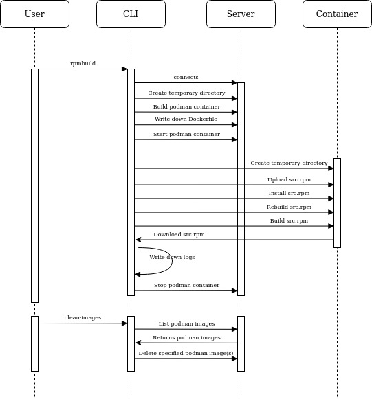

Remote Builder
==============

Remote builder is a simple RPC based application that can be used to build RPMs
on a configured set of hosts.

How does it work?
-----------------

### Architecture

Remote builder is built in two parts:

- a CLI
- a server

The CLI is what users interact with. They will pass onto the CLI tool a
configuration file pointing to one or more host that are running the server
part.

The server is the application the CLI connects to. It executes the commands that
the CLI asks for.

### Workflow

Remote builder has two actions:

- Building the RPMs from a source RPM
- Cleaning up podman images created remotely by remote_builder

#### Building the RPMs from a source RPM

The CLI connects to the server either via SSH or using a subprocess if the
connection type to the host is `socket`. It creates a container there running
the remote builder server code.
The CLI then connects to that container, and uploads the SRPM specified by the
user into that container. It can then extract the content of the SRPM and
rebuild that SRPM. Once the SRPM has been rebuilt, it will install the build
dependencies and finally build the RPMs.
Once the RPMs have been built, they will be exported from the container into the
system that runs the CLI as well as the build logs. If the build fails, only the
logs are exported.

#### Cleaning up podman images

The CLI connects to the server running on one or more hosts. It then retrieves
the list of podman images available on these hosts and will delete all images
that were created by remote builder.

#### Workflow diagram

As the saying goes: a picture is worth a thousand words, so here is a workflow
diagram of the application.

